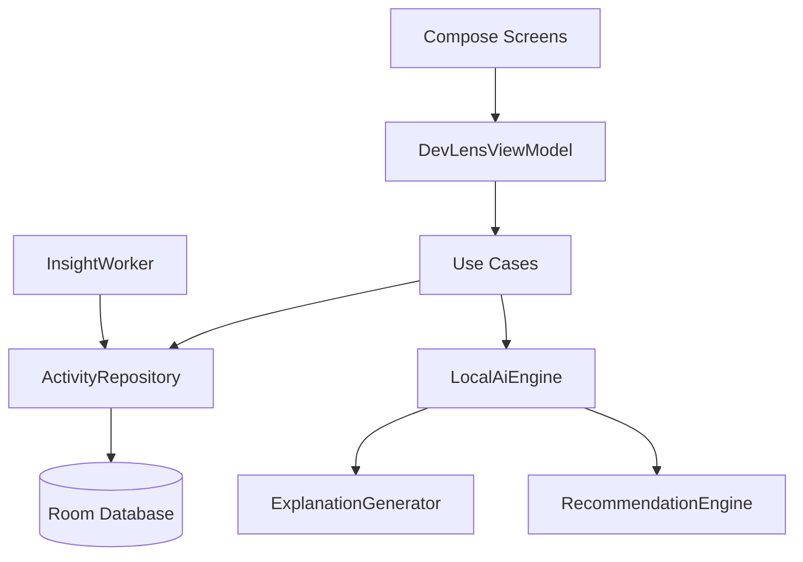
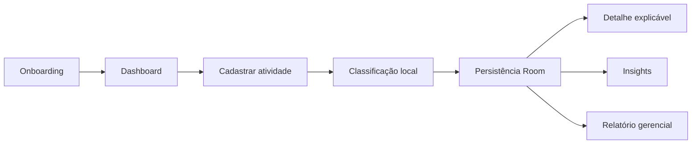
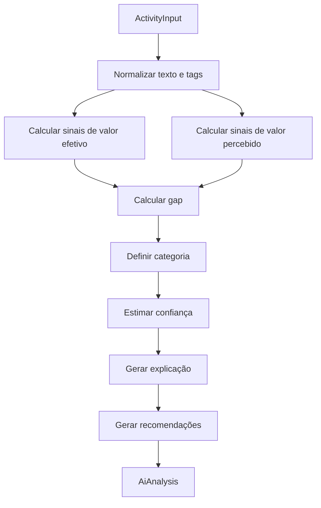
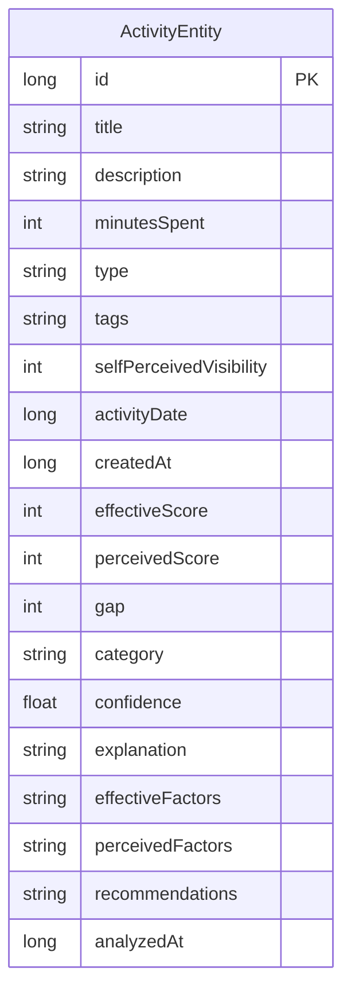
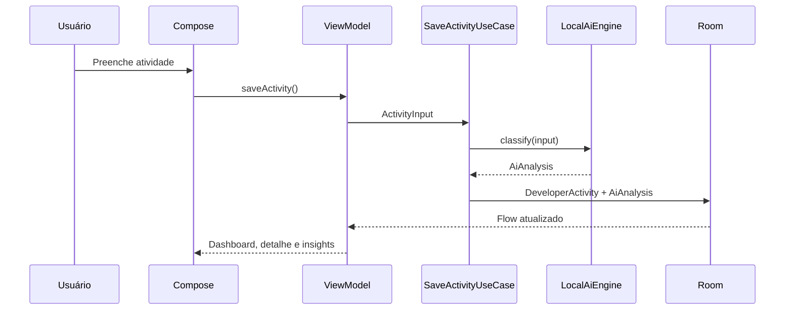

# DevLens

DevLens é um aplicativo Android em Kotlin + Jetpack Compose que ajuda times de desenvolvimento a enxergar a diferença entre valor efetivo e valor percebido das atividades técnicas do dia a dia.

## Demo em Vídeo

<p align="center">
  <video src="demo/final/demo.mp4" controls width="360">
    Abra o arquivo em demo/final/demo.mp4.
  </video>
</p>

Arquivo da demo renderizada: [`demo/final/demo.mp4`](demo/final/demo.mp4).

## Problema Abordado

Em times de software, muito trabalho importante não aparece claramente para a gestão: refatorações, revisões de código, suporte informal, investigação de bugs, redução de dívida técnica, melhoria de performance e documentação. Essas tarefas podem reduzir risco, melhorar confiabilidade e acelerar entregas futuras, mas tendem a ter baixa visibilidade quando não são comunicadas em linguagem de negócio.

## Público-Alvo

- Desenvolvedores de software.
- Tech leads.
- Product managers.
- Engineering managers.

## Proposta de Solução

O DevLens permite registrar atividades diárias, analisar cada registro com IA local, comparar dois scores e gerar recomendações práticas:

- Valor efetivo: impacto real para produto, empresa, usuário ou equipe.
- Valor percebido: quanto a atividade tende a ser visível ou valorizada pela gestão.

## Como a IA Resolve o Problema

Ao salvar uma atividade, uma camada local de IA calcula:

- Score de valor efetivo, de 0 a 100.
- Score de valor percebido, de 0 a 100.
- Diferença entre os scores.
- Categoria de desalinhamento.
- Confiança da classificação.
- Explicação textual.
- Fatores rastreáveis.
- Recomendações para melhorar alinhamento.

O app não usa OpenAI, Gemini, Claude ou qualquer API externa. A inferência é executada no aparelho por um motor modular chamado `LocalAiEngine`.

## Arquitetura do Sistema

O projeto segue MVVM com separação por camadas:

- `presentation`: telas Compose, componentes, navegação e ViewModel.
- `domain`: modelos, repositórios e casos de uso.
- `data`: Room, entidades, DAO, mappers e implementação do repositório.
- `ai`: classificador local, gerador de explicação e motor de recomendação.
- `worker`: WorkManager para manutenção periódica dos insights.
- `docs`: roteiro de apresentação e documentação complementar.



## Tecnologias Utilizadas

- Kotlin.
- Jetpack Compose.
- Material Design 3.
- MVVM.
- Room Database.
- DataStore Preferences.
- WorkManager.
- Coroutines e Flow.
- JUnit para testes unitários.
- Gradle Kotlin DSL.

## Fluxo de Uso

1. Usuário passa pelo onboarding.
2. Usuário registra uma atividade com título, descrição, tempo, tipo, tags e visibilidade percebida.
3. O `LocalAiEngine` classifica a atividade localmente.
4. O app persiste atividade, scores, explicação e recomendações no Room.
5. Dashboard, lista, detalhe, insights e relatório gerencial usam os dados locais.



## Detalhamento do Modelo de IA

A implementação atual usa um modelo local híbrido baseado em NLP simples, regras ponderadas e fuzzy scoring. A arquitetura foi desenhada para permitir substituição futura por ONNX Runtime Mobile ou TensorFlow Lite sem alterar UI ou banco.

Classes principais:

- `ActivityClassifier`: contrato de classificação.
- `LocalAiEngine`: motor local substituível.
- `ExplanationGenerator`: transforma fatores em justificativa natural.
- `RecommendationEngine`: gera próximas ações.
- `AiAnalysis`: saída estruturada da classificação.

## Dados de Entrada

Cada atividade recebe:

- Título.
- Descrição.
- Tempo gasto.
- Tipo da atividade.
- Tags.
- Visibilidade percebida pelo desenvolvedor.
- Data da atividade.

## Saídas do Modelo

- `effectiveScore`.
- `perceivedScore`.
- `gap`.
- `category`.
- `confidence`.
- `explanation`.
- `effectiveFactors`.
- `perceivedFactors`.
- `recommendations`.
- `analyzedAt`.

## Estratégia de Classificação

O classificador combina:

- Peso base por tipo de atividade.
- Palavras-chave de impacto: cliente, usuário, receita, SLA, produção, incidente, OKR.
- Palavras-chave técnicas: refatoração, legado, teste, arquitetura, performance, query, cache, segurança, dívida técnica.
- Palavras-chave de urgência: crítico, urgente, p0, p1, rollback, hotfix.
- Palavras-chave de visibilidade: demo, review, release, relatório, stakeholder, roadmap.
- Visibilidade percebida informada pelo desenvolvedor.
- Tempo gasto.
- Presença ou ausência de tags.

Categorias:

- Alinhado: diferença pequena entre os scores.
- Alto valor invisível: valor efetivo alto e percepção baixa.
- Baixo valor superestimado: percepção alta e valor efetivo menor.
- Atenção necessária: diferença relevante que não se enquadra nos extremos.



## Explicabilidade da IA

Cada resultado mostra:

- Fatores que aumentaram valor efetivo.
- Fatores que aumentaram ou reduziram valor percebido.
- Justificativa em linguagem natural.
- Sugestões de ação.

Exemplo: uma otimização de query crítica recebe alto valor efetivo por performance, produção e usuários afetados. Se não houver sinais de demo, release, gestor, OKR ou comunicação, o valor percebido fica menor e a categoria tende a ser "Alto valor invisível".

## Justificativa da IA Local

A atividade prioriza IA embarcada/local. Por isso, o DevLens usa um classificador determinístico local, sem rede e sem custo operacional. A escolha também favorece privacidade: descrições de trabalho, incidentes e contexto interno do time ficam no aparelho.

Substituição futura:

1. Criar uma implementação `OnnxActivityClassifier` ou `TfliteActivityClassifier`.
2. Manter a assinatura de `ActivityClassifier`.
3. Retornar o mesmo `AiAnalysis`.
4. Trocar a instância no `DevLensContainer`.

## Como Executar o Projeto

Requisitos:

- Android Studio.
- JDK 17.
- Android SDK com compile SDK 35.
- Gradle compatível com Android Gradle Plugin 8.5.2.
- Emulador Android ou dispositivo físico com Android 8.0, API 26, ou superior.

Passos:

1. Abra a pasta do projeto no Android Studio.
2. Aguarde o sync do Gradle.
3. Selecione a configuração `app`.
4. Execute o app em um emulador ou dispositivo Android.

## Como Verificar a Entrega Mobile

A entrega principal é exclusivamente mobile. A pasta `app/` contém a implementação Android em Kotlin + Jetpack Compose.

Para verificar o aplicativo manualmente:

1. Abra o projeto no Android Studio pela raiz do repositório.
2. Confirme que o módulo `:app` sincronizou sem erros.
3. Inicie um emulador Android ou conecte um dispositivo físico.
4. Execute a configuração `app`.
5. No aplicativo, avance pelo onboarding e confira o dashboard inicial.
6. Cadastre uma nova atividade técnica informando título, descrição, tempo, tipo, tags e visibilidade percebida.
7. Salve a atividade e verifique se a análise local retorna valor efetivo, valor percebido, categoria, confiança, explicação, fatores e recomendações.
8. Navegue pelas telas de dashboard, histórico, detalhe, insights e relatório gerencial para confirmar que os dados persistidos aparecem corretamente.
9. Feche e abra o aplicativo novamente para conferir a persistência local via Room e DataStore.

Para verificar os testes unitários:

- Pelo Android Studio, abra a aba Gradle e execute `:app:testDebugUnitTest`.
- Se o wrapper Gradle tiver sido gerado pela IDE, rode `gradlew.bat testDebugUnitTest` no Windows ou `./gradlew testDebugUnitTest` no macOS/Linux.

O fluxo esperado é que o app funcione sem chamadas externas de IA: a classificação acontece localmente pelo `LocalAiEngine`, e os dados continuam no aparelho.

## Estrutura de Pastas

```text
app/src/main/java/com/devlens
  ai/
  data/
    dao/
    entities/
    local/
    mappers/
    repository/
  domain/
    models/
    repositories/
    usecases/
  presentation/
    components/
    navigation/
    screens/
    theme/
    viewmodels/
  worker/
docs/
```

## Diagramas

### Diagrama de Entidades



### Fluxo de Dados



## Roteiro do Vídeo de Apresentação

O vídeo final está renderizado em [`demo/final/demo.mp4`](demo/final/demo.mp4), e o roteiro completo está em [`docs/video-script.md`](docs/video-script.md).

## Limitações e Melhorias Futuras

- O modelo atual é heurístico e interpretável, não estatístico.
- A classificação pode ser calibrada com dados reais do time.
- Uma versão futura pode usar ONNX/TFLite com embeddings locais.
- O relatório pode exportar PDF.
- O app pode ter filtros por squad, sprint e período.

## Relação com o Barema da Atividade

- Clareza da solução: telas e README explicam problema, público e proposta.
- IA pertinente: classificador compara valor efetivo e valor percebido.
- IA local: nenhuma API externa é usada.
- Arquitetura realista: MVVM, Room, DataStore, WorkManager e Compose.
- Fluxo de dados claro: diagramas Mermaid e separação por camadas.
- Explicabilidade: fatores, justificativa e confiança aparecem no detalhe.
- Rastreabilidade: `AiAnalysis` persiste scores, fatores e recomendações.
- Relatório gerencial: tela própria com resumo copiável.
- Dados de exemplo: repository popula cinco atividades iniciais.
- Testes unitários: cobrem cálculos, desalinhamento, explicação, recomendação e mapper.
- Vídeo: demo renderizada em `demo/final/demo.mp4` e roteiro em `docs/video-script.md`.
